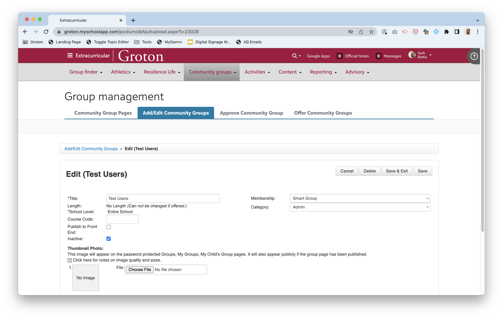
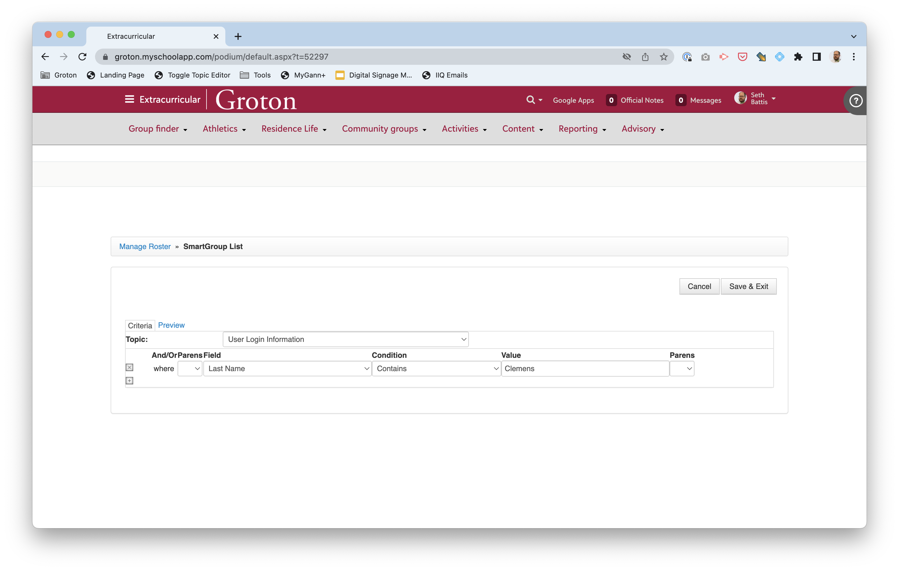
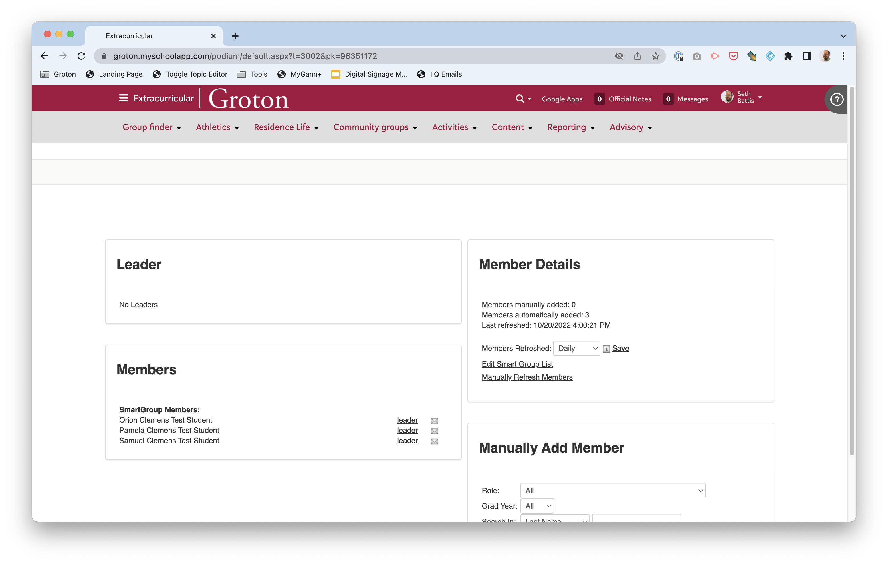
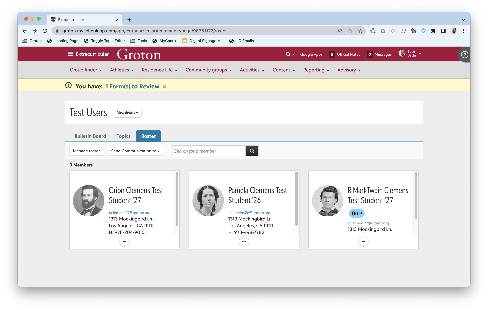
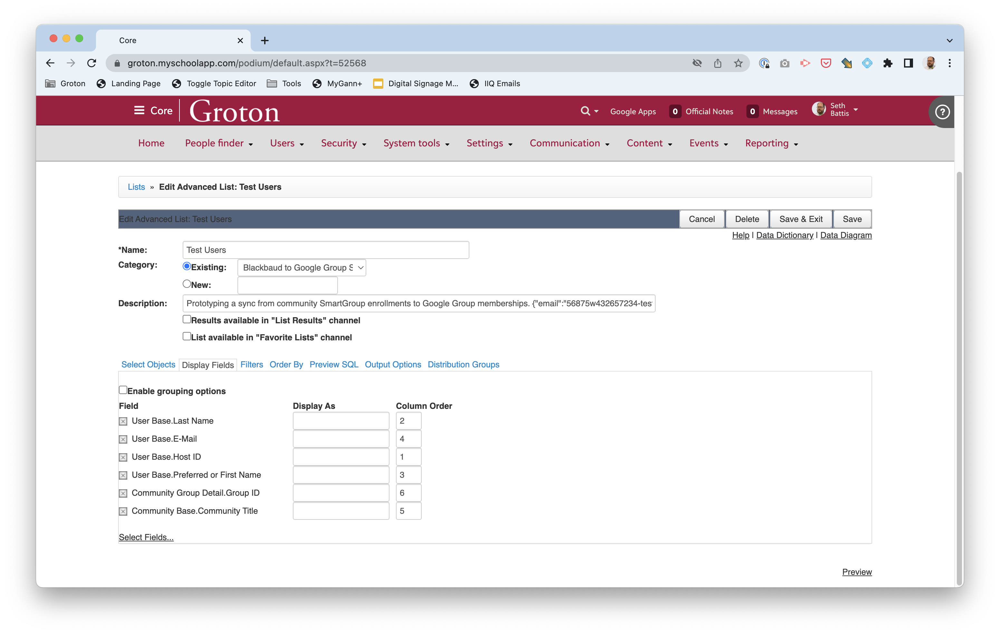
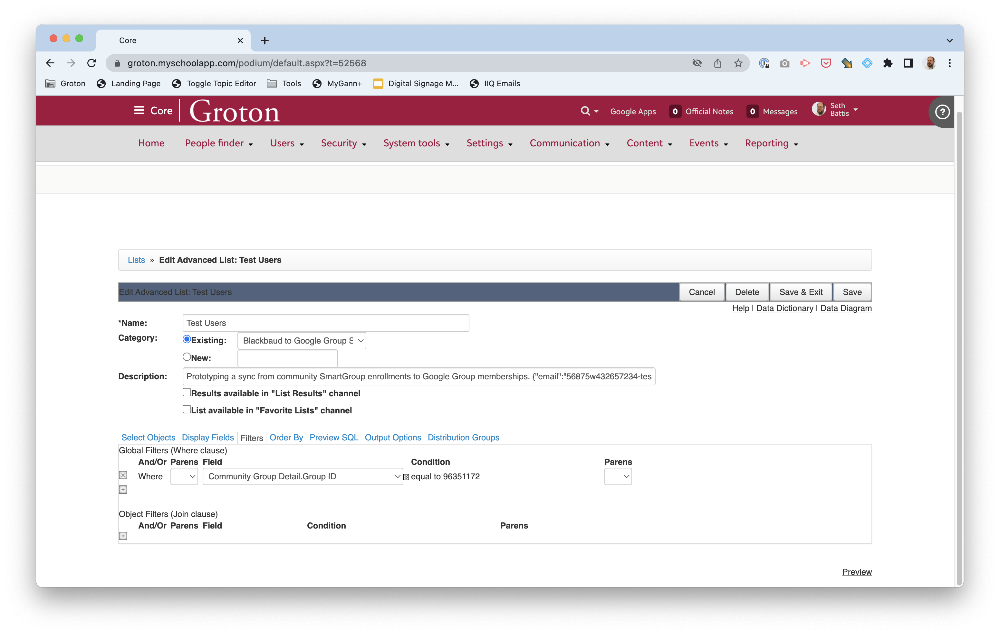

# Blackbaud to Google Group Sync

Sync membership of Blackbaud LMS community groups to Google Groups

The basic idea of this script is that it will perform a one-way sync of membership in a subset of Blackbaud community groups into specific Google Groups. Thus, Blackbaud community groups can be set up with SmartGroup rosters that automatically refresh, the sync process runs regularly, and Google Group memberships are updated automatically to match, allowing for the creation of SIS-driven, role-based groups in Google.

## Setup

### Blackbaud

1. Copy one of your [SKY API developer account subscription access keys](https://developer.blackbaud.com/subscriptions/) (this will be the Heroku `BLACKBAUD_ACCESS_KEY` environment variable)
2. Go to your [Applications](https://developer.blackbaud.com/apps/), add a new application.
    1. Give a dummy website URL for now (until the Heroku instance is standing)
    2. Copy the OAuth client ID and secret (these will be the `BLACKBAUD_CLIENT_ID` and `BLACKBAUD_CLIENT_SECRET` Heroku environment variables, respectively.
3. [In the Blackbaud Marketplace](https://app.blackbaud.com/marketplace/manage) click the Connect App button and use the OAuth client ID as the Application ID to connect the app to your Blackbaud instance

...pause while you set up Google and Heroku...

3. Once Heroku is set up, get the address to the the running Heroku app instance
4. Update [the App in your SKY API developer profile](https://developer.blackbaud.com/apps/) 1. Add a Redirect URI to `https://<instance name>.herokuapp.com/token.php` 2. Edit the application to set a relevant website URL (e.g. `https://<instance name>.herokuapp.com`

### Google

1. In [Google Cloud](https://console.cloud.google.com/), create a new project
2. Under [IAM & Admin](https://console.cloud.google.com/iam-admin/iam) add a Google Workspace admin user as a principal with `Owner` role. (This user's email will be the value for the Heroku `GOOGLE_DELEGATED_ADMIN` environment variable)
3. In [APIs & Services](https://console.cloud.google.com/apis/dashboard)
    1. Enable the `Admin SDK API`
    2. Under [Credentials](https://console.cloud.google.com/apis/credentials), create a Service Account
    3. Add a key to the Service Account and download the JSON credentials file (the contents of this file are value for the Heroku `GOOGLE_CREDENTIALS` environment variable)
4. Copy the Unique ID of the Service Account (a 21-digit number)
5. In Google Workspace Admin, go to Security/Access and data control/API controls and [Manage Domain Wide Delegation](https://admin.google.com/ac/owl/domainwidedelegation)
    1. Add a new API client
    2. The Client ID is the Service Account Unique ID
    3. The OAuth scope is `https://www.googleapis.com/auth/admin.directory.group`
    4. Authorize

#### Commentary

This feels super cumbersome. But... what's going on is that, while we are using the Google Workspace admin user's admin access to get to the Google Cloud Admin SDK (only admins can access it) so that we can mess with groups... we are doing so _through_ the service account that has access _only_ to a specific set of API endpoints (the group management ones, in this case).

Since we are using the service accounts credentials, and the admin account's email address, the admin is able to create a user who has very narrow delegated permissions within the full range of admin capabilities, and care share that access (via the service account) with another user (this app) without exposing the rest of the admin account's access.

For example, an attempt by the service account to access users, rather than groups results in an error:

```json
{
    "error": {
        "code": 403,
        "message": "Request had insufficient authentication scopes.",
        "errors": [
            {
                "message": "Insufficient Permission",
                "domain": "global",
                "reason": "insufficientPermissions"
            }
        ],
        "status": "PERMISSION_DENIED",
        "details": [
            {
                "@type": "type.googleapis.com/google.rpc.ErrorInfo",
                "reason": "ACCESS_TOKEN_SCOPE_INSUFFICIENT",
                "domain": "googleapis.com",
                "metadata": {
                    "service": "admin.googleapis.com",
                    "method": "ccc.hosted.frontend.directory.v1.DirectoryUsers.List"
                }
            }
        ]
    }
}
```

### Heroku

[](https://heroku.com/deploy)

1. Click the link above
2. Fill in the blanks on the environment variables

#### TODO Document Google App Engine instead of Heroku

## Management

### TODO update documentation to remove the (redundant) community groups step

The basic idea of this script is that it will perform a one-way sync of membership in a subset of Blackbaud community groups into specific Google Groups. Thus, Blackbaud community groups can be set up with SmartGroup rosters that automatically refresh, the sync process runs regularly, and Google Group memberships are updated automatically to match, allowing for the creation of SIS-driven, role-based groups in Google.

The core idea then is that each synced group starts out in Blackbaud as a community group with a roster.



Note that the group is flagged as `inactive` so that it will not be visibile to members (but still exists, and so can be accessed by advanced lists). In the SmartGroup configuration we select the desired users based on our criteria (theoretically role-based, but it could be enrollment-based, or some other criteria -- here, a commonality among all our test users.



We set the roster to automatically update regularly.



Note that we could also manually add users (e.g. admins) to a group as well. The result is a roster of relevant users.



To exfiltrate these group memberships from Blackbaud, we need to use the Advanced Lists (which are accessible through the SKY API).

A generic such list is setup thus:


In configuring the advanced list, we need to pay attention to:

1. The `Name` of the list -- this can be synced to the Google Group, allowing us to update the name of the Google Group from Blackbaud.
2. The `Category` in which the list resides. As there are many advanced lists, we use this as a filter to determine which lists are relevant to the script. Currently, the script examines all lists in the `Blackbaud to Google Group Sync` category.
3. The `Description` can be the usual free-form text, but _must_ also contain at at least one JSON-encoded parameter. At present, the only supported parameter is `email`, but additional paramters are planned:
    - `email` a text value: the email address of the destination Google Group into which to sync this membership
    - `update-name` is a boolean value, defaulting to `true`, that determines whether or not to update the name of the Google Group to match the name of the list (which is presumptively the name of the group too).
    - `dangerously-purge-google-group-owners` is a boolean value, defaulting to `false`, that determines whether or not to pay attention to a Google Group member's ownership role when deciding to purge them from the group if they are not members of the Blackbaud community group.

Generically, the list would display the following:



Which fields are displayed by the list is arbitrary, but, at a minimum, the script expects:

1. A field named `E-Mail` that contains the user's email address that can be matched in the Google Group membership.

Other values are useful for debugging.

To limit the list to just the members of our specific group, we must filter by `Group ID`:



Note that the `Group ID` value can be gleaned from the URL of the group's, for example, roster page:

```
https://groton.myschoolapp.com/app/extracurricular#communitypage/96351172/roster
```

...where the ID is the mumerical value.

#### Observation

The community groups are not _necessary_ for the functioning of this script. They are useful, in that they provide an easy mental model, and potentially an easier enrollment interface, than building everything in an Advanced List. But the community groups could be completely eliminated, so long as the Advanced Lists generated the right output for the script.
