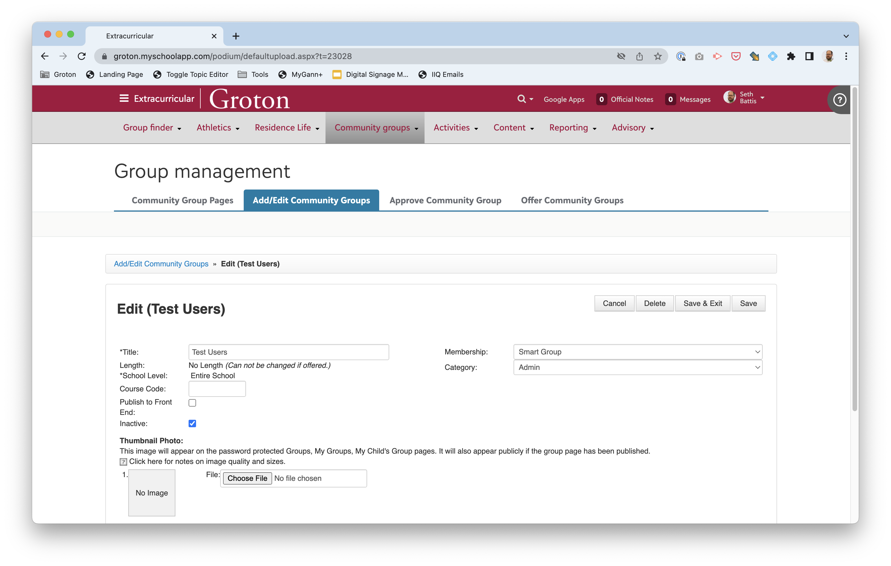
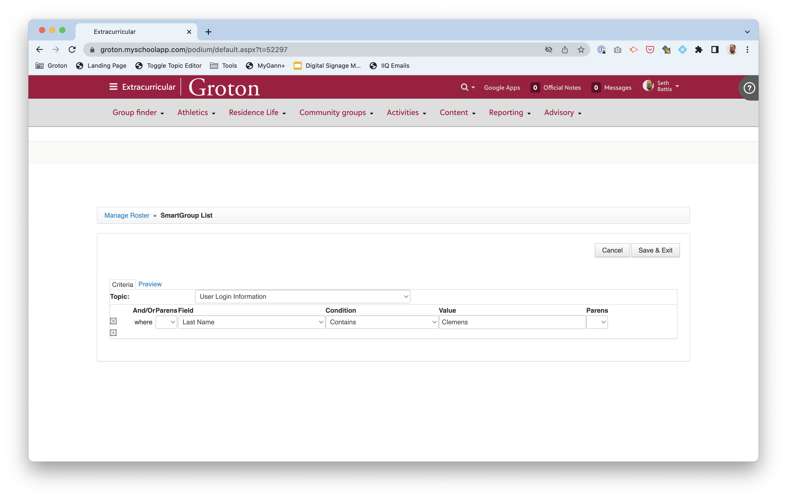
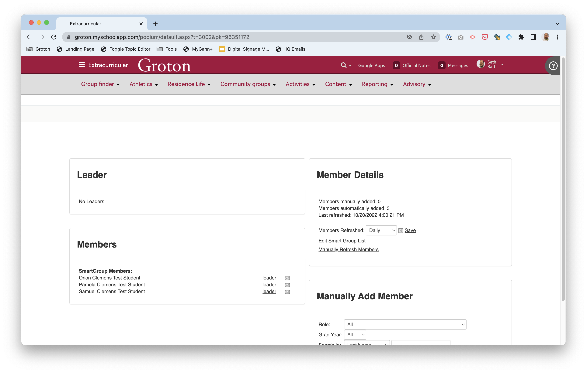
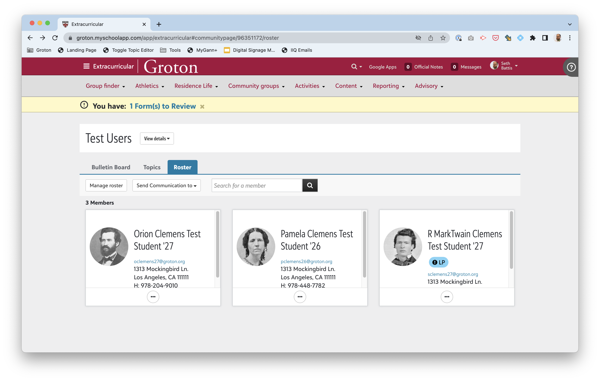
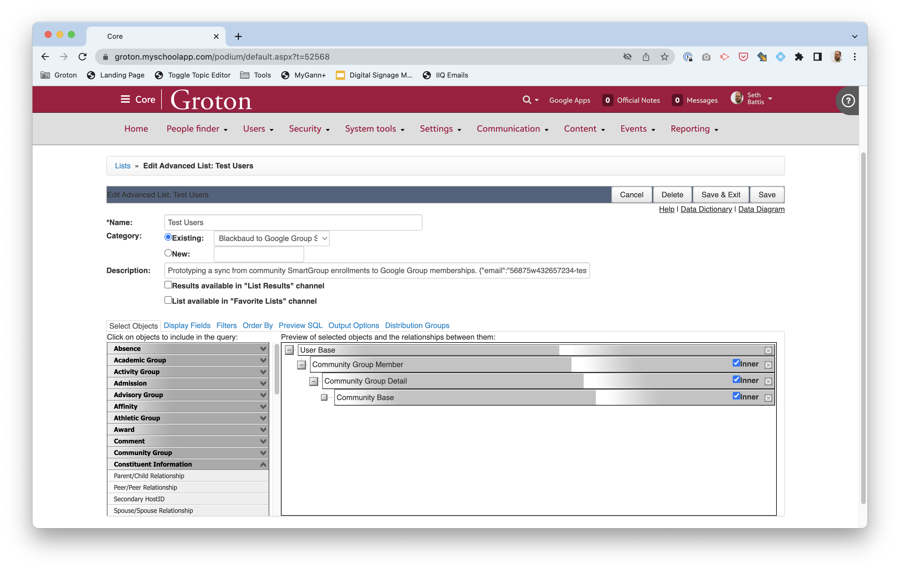
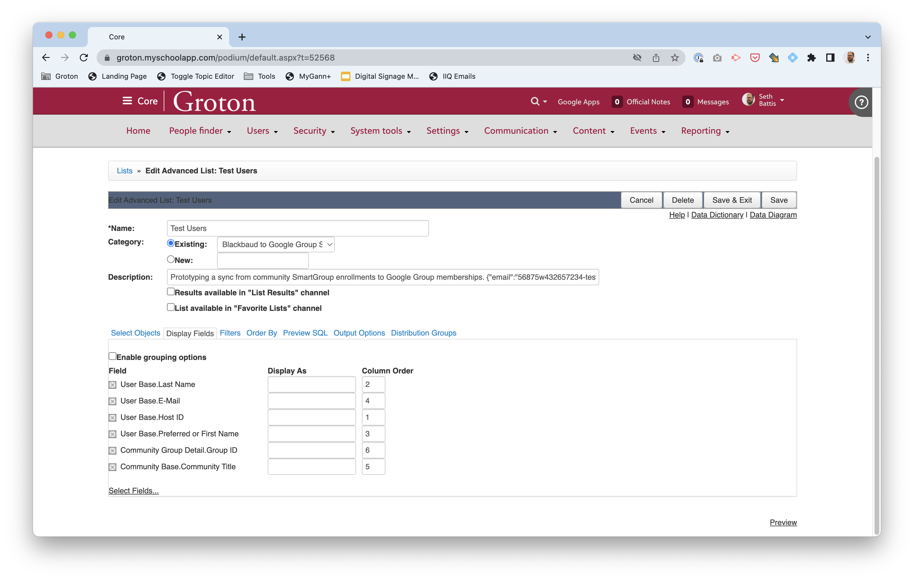
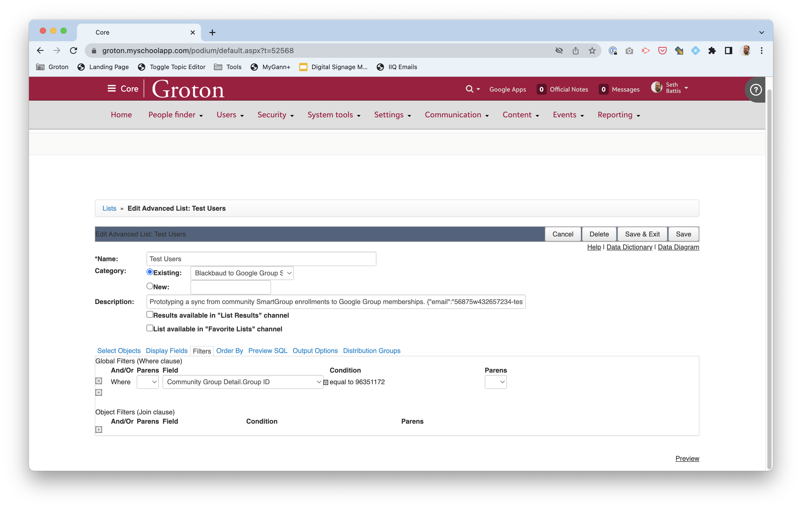

# Advanced Lists of Blackbaud Group Rosters

The core idea then is that each synced group starts out in Blackbaud as a community group with a roster. (The same could be applied to an academic group (aka a "class") or activity grup or advisory just as easily.)



Note that the group is flagged as `inactive` so that it will not be visibile to members (but still exists, and so can be accessed by advanced lists). In the SmartGroup configuration we select the desired users based on our criteria (theoretically role-based, but it could be enrollment-based, or some other criteria -- here, a commonality among all our test users.



We set the roster to automatically update regularly.



Note that we could also manually add users (e.g. admins) to a group as well. The result is a roster of relevant users.



To exfiltrate these group memberships from Blackbaud, we need to use the Advanced Lists (which are accessible through the SKY API).

A generic such list is setup thus:



In configuring the advanced list, we need to pay attention to:

1. The `Name` of the list -- this can be synced to the Google Group, allowing us to update the name of the Google Group from Blackbaud.
2. The `Category` in which the list resides. As there are many advanced lists, we use this as a filter to determine which lists are relevant to the script. Currently, the script examines all lists in the `Blackbaud to Google Group Sync` category.
3. The `Description` can be the usual free-form text, but _must_ also contain at at least one JSON-encoded parameter. At present, the only supported parameter is `email`, but additional paramters are planned:
   - `email` a text value: the email address of the destination Google Group into which to sync this membership
   - `update-name` is a boolean value, defaulting to `true`, that determines whether or not to update the name of the Google Group to match the name of the list (which is presumptively the name of the group too).
   - `dangerously-purge-google-group-owners` is a boolean value, defaulting to `false`, that determines whether or not to pay attention to a Google Group member's ownership role when deciding to purge them from the group if they are not members of the Blackbaud community group.

Generically, the list would display the following:



Which fields are displayed by the list is arbitrary, but, at a minimum, the script expects:

1. A field named `E-Mail` that contains the user's email address that can be matched in the Google Group membership.

Other values are useful for debugging.

To limit the list to just the members of our specific group, we must filter by `Group ID`:



Note that the `Group ID` value can be gleaned from the URL of the group's, for example, roster page:

```
https://groton.myschoolapp.com/app/extracurricular#communitypage/96351172/roster
```

...where the ID is the numerical value.
